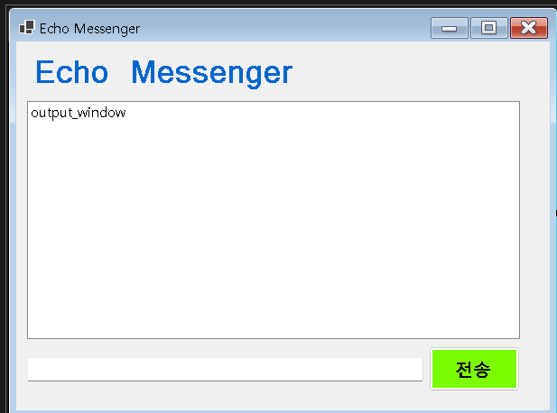
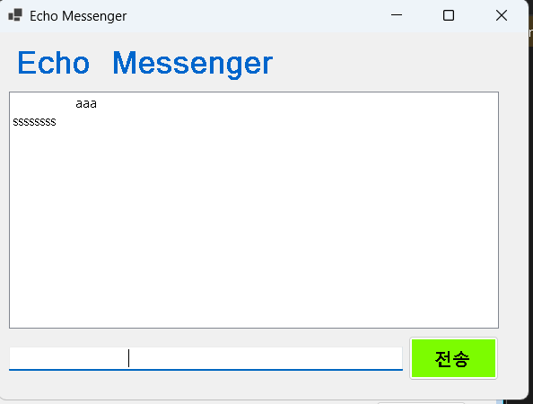
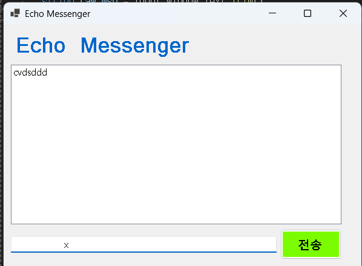
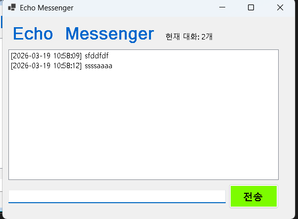
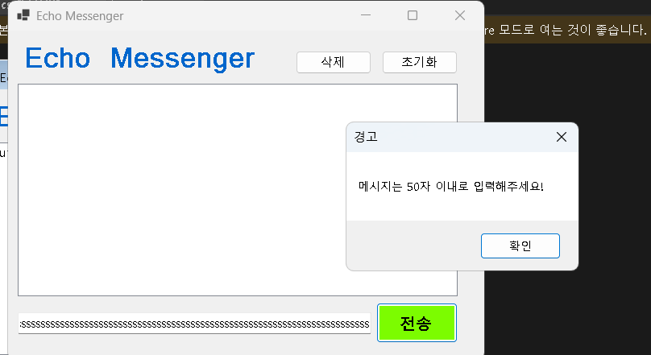

# (C# 코딩) 에코 메신저 EchoMessenger
## 개요
- C# 프로그래밍 학습
- 1줄 소개: 사용자 키보드 입력을 받아서 처리하며 시간과 보낸 메시지 개수 확인, 삭제 및 초기화 기능까지 존재하는 프로그램
- 사용한 플랫폼: - C#, .NET Windows Forms, Visual Studio, GitHub
- 사용한 컨트롤:
    - Label, TextBox, ListBox, Button
- 사용한 기술과 구현한 기능 : 
    - Visual Studio를 이용하여 UI 디자인 Trim함수를 이용한 공백 제거
    - 수업중 가르쳐 주신 Time으로 시간값 구현
    - KeyDown 이벤트를 사용하여 Enter로도 전송이 가능하도록 구현
    - 출력창 인덱스 값으로 삭제 버튼 로직 예외 구현

## 실행 화면 (과제1)
- 과제1 코드의 실행 스크린샷
![과제1 실행화면]

- 과제 내용: 
    - GitHub를 활용한 기본적인 버전 관리 및 커밋, 푸시 과정 학습
    - Label(표시), TextBox(입력), Button(전송), ListBox(대화창)를 적절히 배치하여 기본적인 UI 구성
    - 전송 버튼 클릭 시 TextBox의 텍스트를 ListBox의 항목(Items)으로 추가
    - 추가 직후 TextBox의 내용을 비워(Clear) 다음 입력을 준비
    - 간단한 이벤트 기반 프로그래밍 흐름 이해 및 적용

- 구현 내용과 기능 설명
    - ListBox를 중앙에, TextBox를 하단에 배치하여 채팅 UI와 유사한 구조로 설계함
    - 전송 버튼 클릭 시 TextBox의 문자열을 ListBox에 추가하고 입력창을 자동으로 초기화
    - 함수명을 input_window, output_window, Btn_Forwarding 등으로 지정하여 역할 구분
    - 반복 입력 시 ListBox에 메시지가 순차적으로 누적되며 스크롤 기능이 자동 활성화됨
    - 기본적인 UI 이벤트 처리 구조(Button Click 이벤트)에 대한 이해를 바탕으로 구현

## 실행 화면 (과제2)
- 과제2 코드의 실행 스크린샷
![과제2 실행화면]

- 과제 내용
    - 사용자 편의성 향상을 위한 UX 개선
    - 입력창 자동 포커스 처리 및 기존 입력값 관리
    - 엔터 키를 통한 메시지 전송 기능 추가
    - 공백 및 잘못된 입력 방지 로직 구현

- 구현 내용과 기능 설명
    - Focus() 함수를 사용하여 프로그램 실행 및 입력 후에도 입력창에 자동으로 포커스 유지
    - KeyDown 이벤트를 활용하여 Enter 키 입력 시 버튼 클릭 없이도 메시지 전송 가능하도록 구현
    - Trim() 함수를 활용하여 공백 입력을 제거하고, 빈 문자열 입력 시 전송되지 않도록 예외 처리
    - 사용자 입력 흐름을 고려하여 반복 입력 시 불편함이 없도록 UX 개선
    - 키보드 입력과 UI 이벤트를 함께 활용하는 이벤트 처리 방식에 대한 이해 향상

## 실행 화면 (과제3)
![과제3 실행화면]

- 과제 내용:
    - 데이터 가공 및 상태 표시 기능 추가
    - 메시지에 타임스탬프를 포함하여 시간 정보 표시
    - 메시지 개수 카운팅 기능 구현
    - 문자열 전처리를 통한 데이터 정제

- 구현 내용과 기능 설명
    - DateTime을 활용하여 현재 시간을 yyyy-MM-dd HH:mm:ss 형식으로 출력
    - 메시지 전송 시 시간 정보를 함께 표시하여 로그 형태로 확인 가능하도록 구현
    - Trim() 함수로 불필요한 공백 제거 후 데이터 저장
    - ListBox의 Items.Count를 활용하여 현재 메시지 개수를 실시간으로 표시
    - 데이터의 상태를 시각적으로 표현하여 사용자에게 명확한 정보 제공

## 실행 화면 (과제4)
![과제4 실행화면]
 

- 과제 내용:
    - 데이터 관리 및 심화 기능 구현
    - 선택 항목 삭제 기능 추가
    - 전체 초기화 기능 구현
    - 입력 데이터 제한 및 예외 처리 강화

- 구현 내용과 기능 설명
    - ListBox에서 선택된 항목을 삭제하는 기능 구현
    - 선택되지 않은 상태에서 삭제 시 오류가 발생하지 않도록 예외 처리 추가
    - 전체 메시지를 초기화하는 버튼 구현 및 정상 동작 확인
    - 메시지 길이가 50자를 초과할 경우 MessageBox를 통해 사용자에게 경고 출력
    - 삭제 시 메시지 개수(lbl_Count)가 함께 감소하도록 로직 구성하여 데이터 일관성 유지
    - 사용자 입력 검증 및 프로그램 안정성을 고려한 방어적 코딩 적용

## 배운 내용
    - 이번 과제를 통해 C#의 Windows Forms 환경에서 UI를 구성하고 이벤트 기반으로 동작하는 프로그램의 전체 흐름을 이해할 수 있었다. 특히 Button 클릭 이벤트, KeyDown 이벤트 등 다양한 이벤트 처리 방식을 직접 구현하면서 사용자 입력이 어떻게 프로그램 동작으로 이어지는지에 대해 체계적으로 학습할 수 있었다.
    - Trim() 함수를 활용한 문자열 처리와 DateTime을 이용한 시간 데이터 처리 방법을 익히면서, 단순한 입력 출력이 아닌 데이터 가공의 중요성도 함께 배울 수 있었다. 특히 시간 정보를 포함한 메시지 출력 기능을 구현하면서 실제 로그 시스템과 유사한 구조를 경험할 수 있었다.
    - ListBox의 Items.Count를 활용하여 메시지 개수를 관리하고, 삭제 및 초기화 기능을 구현하면서 데이터 상태를 유지하고 갱신하는 로직에 대한 이해도가 향상되었다. 더불어 선택되지 않은 상태에서 삭제를 시도할 경우 발생하는 오류를 예외 처리로 해결하면서 프로그램의 안정성을 높이는 방법도 익힐 수 있었다.
    - GitHub를 활용하여 프로젝트를 관리하고, 커밋 및 푸시를 진행하면서 버전 관리의 기본 개념을 실습할 수 있었으며, README.md 파일을 통해 프로젝트 내용을 정리하고 문서화하는 방법도 새롭게 알게 되었다. 이를 통해 단순히 코드를 작성하는 것을 넘어, 다른 사람에게 프로젝트를 설명하는 능력의 중요성도 느낄 수 있었다.
    - 전반적으로 이번 과제를 통해 UI 설계, 이벤트 처리, 데이터 관리, 예외 처리, 그리고 Git을 활용한 협업 도구 사용까지 프로그래밍의 기초적인 전반을 경험할 수 있었으며, 앞으로 더 복잡한 프로그램을 구현하기 위한 기반을 다질 수 있는 의미 있는 학습 과정이었다.
